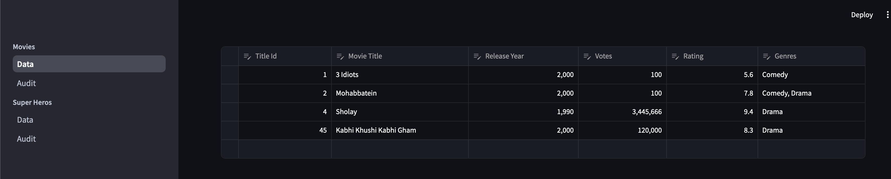
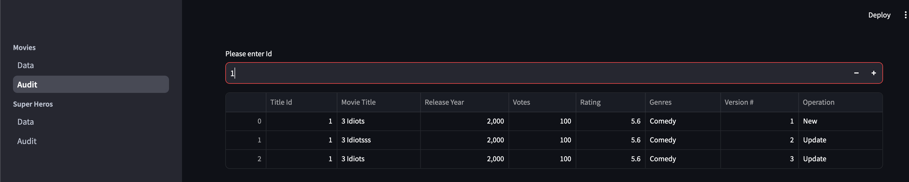
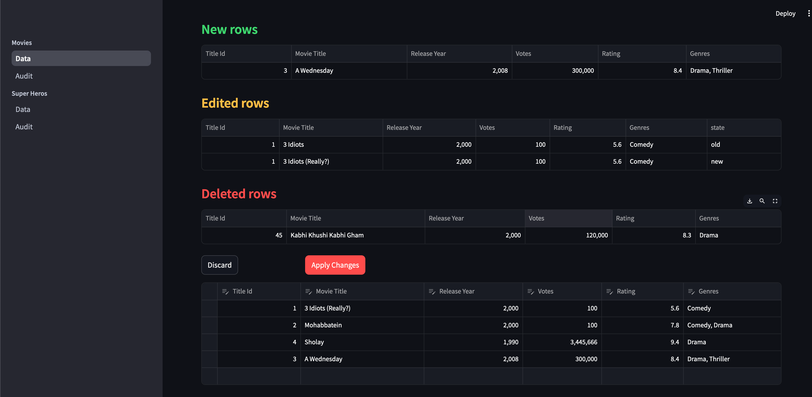

The project uses [streamlit](https://streamlit.io/) to provide an interface to modify table data. Additionally,
- there are some validation on the data using [pydantic](https://docs.pydantic.dev/latest/)
- the project also maintains audit table which maintains different version of each row
- there are thin wrappers available in `core` package
- the project is highly configurable, interface is in `base` package and sample implementations are in `impl` package

Currently, it is a multipage app, allowing to modify data in `Movies` and `SuperHeros` tables (and maintaining their logs)
- in fact, in `SuperHeros` data, the key is a composite key, and it is being handled very smoothly by backend in java (a Spring project)

Following is a screenshot of the data screen

And following is a screenshot of the audit screen

And following is a screenshot of the change summary

Its backend data requests are handled by [this](https://github.com/aniliitb10/MoviesDB) project